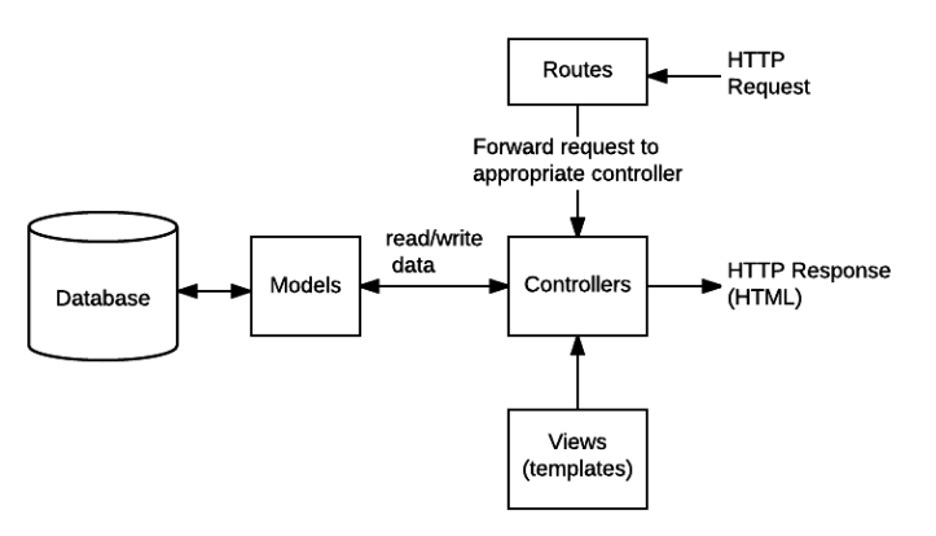
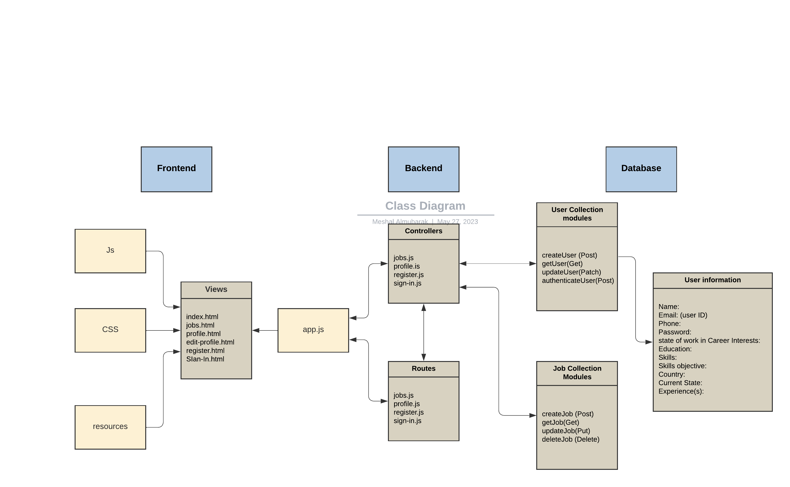
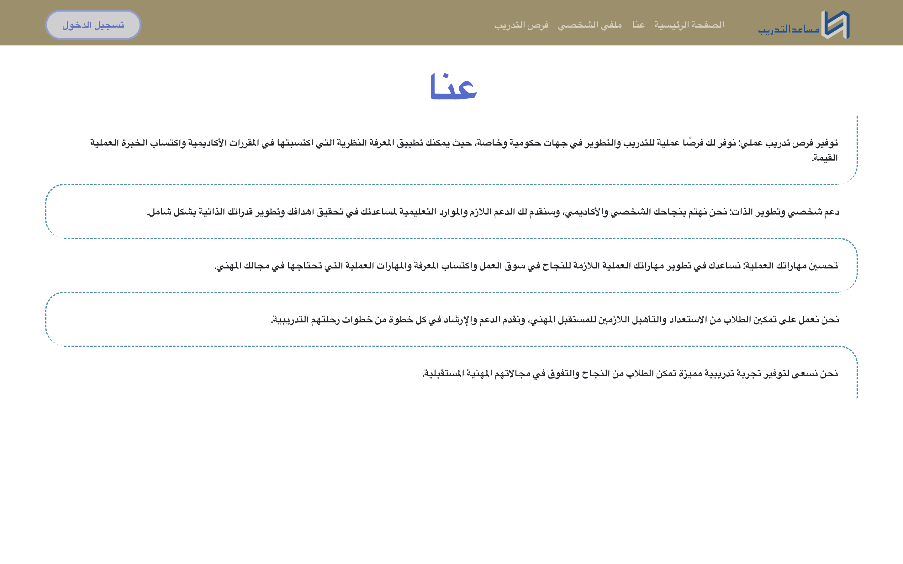
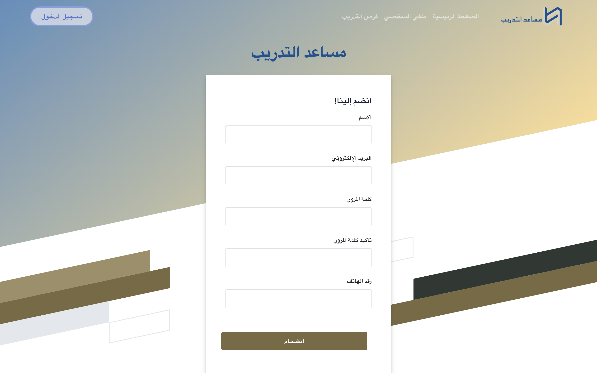
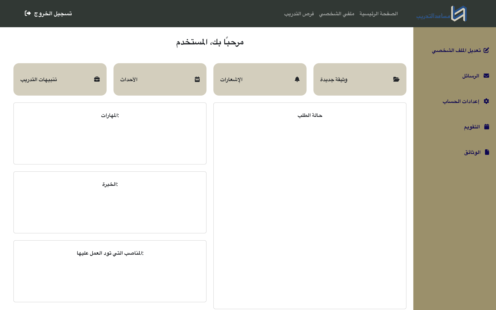
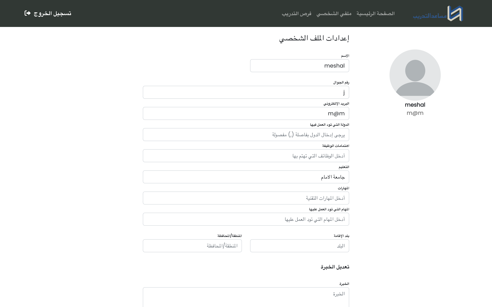
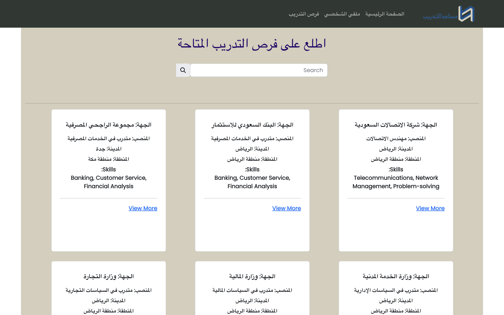

# The Internship Helper

The Internship Helper is a user-friendly web application designed to aid students in finding the perfect internship opportunities. It streamlines the job search process by curating a list of opportunities that align with each student's profile, skills, and interests.

## Table of Contents
- [Project Overview](#project-overview)
- [Technology Stack](#technology-stack)
- [User Interaction](#user-interaction)
- [Database Schema](#database-schema)
- [CRUD Operations](#crud-operations)
- [Code Overview](#code-overview)
- [Conclusion](#conclusion)
- [Final Product](#Final-Product)

## Project Overview
The Internship Helper is a comprehensive platform where students can organize their skills, specify their career interests, and find curated internship listings. The application is designed to save time and effort for students by making the process of finding and applying for internships simple and efficient.

## Technology Stack
The Internship Helper leverages a solid technology stack that includes:
- Front-end: HTML, CSS, and JavaScript for a visually pleasing and user-friendly interface.
- Back-end: Node.js and Express.js for reliable server-side operations.
- Database: MongoDB for efficient data storage and retrieval.
- Authentication: Ensuring secure access and user privacy on each page.

## User Interaction
The application offers a seamless user journey with simple navigation and functionality. It includes user registration and sign-in, profile viewing and editing, job searching based on user preferences, direct job application, and profile updates.

## Database Schema
Our MongoDB database consists of two primary collections:
1. User Info Collection: Storing comprehensive information about each user including their unique identification, authentication info, personal details, and professional data.
2. Job Post Data Collection: Holding data about available internship opportunities, ensuring all necessary information is available for users.

## CRUD Operations
The application supports a range of CRUD operations, allowing users to fetch their profile and job application info, create and update their profile details, and retrieve login information matching.

## Code Overview
Our codebase follows best practices such as modularity, object-oriented programming, semantic HTML, and CSS styling, ensuring the application is easy to understand, modify, and debug.

## Conclusion
The Internship Helper is committed to making the process of finding internships simpler and more efficient. By coupling a user-centric design with a robust technology stack, we've created a platform that is flexible, scalable, and responsive to the changing needs of users. We aim to continuously improve and evolve our platform to better serve our users in their quest to find the perfect internship opportunities.

## Final product
1.	Home Page:

2.  About:

3.	Registration:

4.	Sign-In:

5.	Profile:

6.	Edite-Profile:

7.	Job Search:

